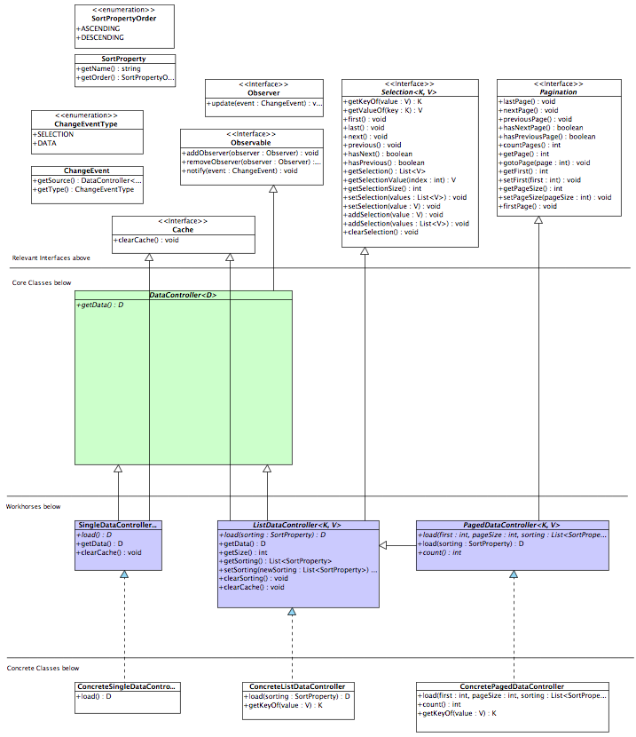

# lazy-datacontroller

Data Controller framework with support for lazy loading, pagination, single- and multi-selection and observer pattern.

## Overview

Build flexible and powerful master–detail interfaces with these three classes SingleDataController, ListDataController and PagedListDataController



## Adapters

Adapters allow you to adapt a lazy controller to a view controller like JSF DataModel, PrimeFaces LazyDataModel. 


## Sample page

This master–detail interface sample is taken from the included JSF Test module lazy-datacontroller-jsftest


## Building it
Lazy Datacontroller uses Apache Maven as Build Tool 

```bash
git clone https://github.com/khennig/lazy-datacontroller.git
cd lazy-datacontroller
mvn install
```

## Adding it to your project
Add the following dependency to your pom.xml:/project/dependencies

```xml
<dependency>
    <groupId>com.tri-systems.ui.ldc</groupId>
    <artifactId>lazy-datacontroller-impl</artifactId>
    <version>1.0.0-SNAPSHOT</version>
</dependency>
<dependency>
    <groupId>com.tri-systems.ui.ldc</groupId>
    <artifactId>lazy-datacontroller-pfadapter</artifactId>
    <version>1.0.0-SNAPSHOT</version>
</dependency>
```

# License
[MIT License](http://www.opensource.org/licenses/mit-license.php)